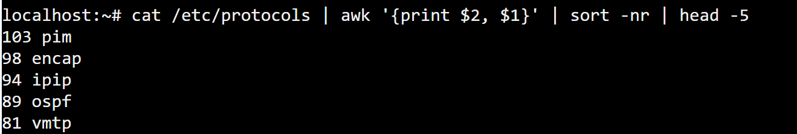
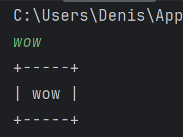
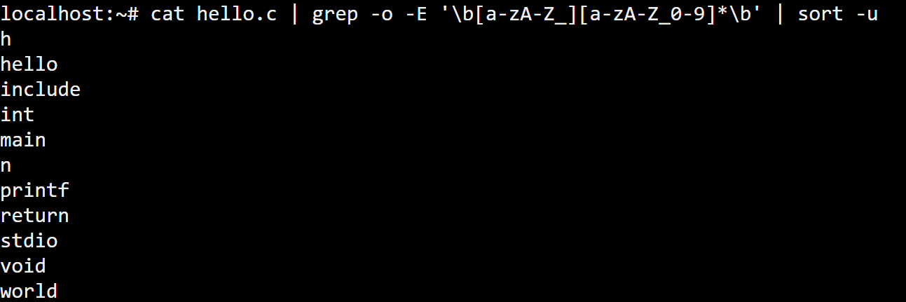
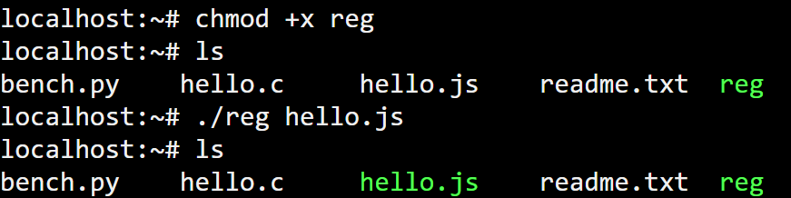
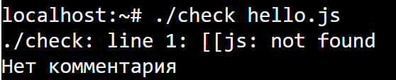

# Задание 1
```
cat /etc/passwd | grep -o -E '^\w+' | sort
```


# Задание 2
```
cat /etc/protocols | awk '{print $2, $1}' | sort -nr | head -5
```


# Задание 3
```
line = input()
print("+" + "-" * (len(line) + 2) + "+")
print("| " + line + " |")
print("+" + "-" * (len(line) + 2) + "+")
```


# Задание 4
```
cat hello.c | grep -o -E '\b[a-zA-Z_][a-zA-Z_0-9]*\b' | sort -u
```


# Задание 5
```
file=$1
chmod 755 "./$file"
sudo cp "$file" /usr/local/bin/
```


# Задание 6
```
if [["${1##*.}" == "js" ]] || [[ "${1##*.}" == "cpp" ]]; then
        if [[ "${(head -n 1 $1):0:2}"; then
                echo "Есть комментарий"
        else
                echo "Нет комментария"
        fi
else
        if [[ "${line:0:1}" == "#" ]]; then
                echo "Есть комментарий"
        else
                echo "Нет комментария"
        fi
fi
```

